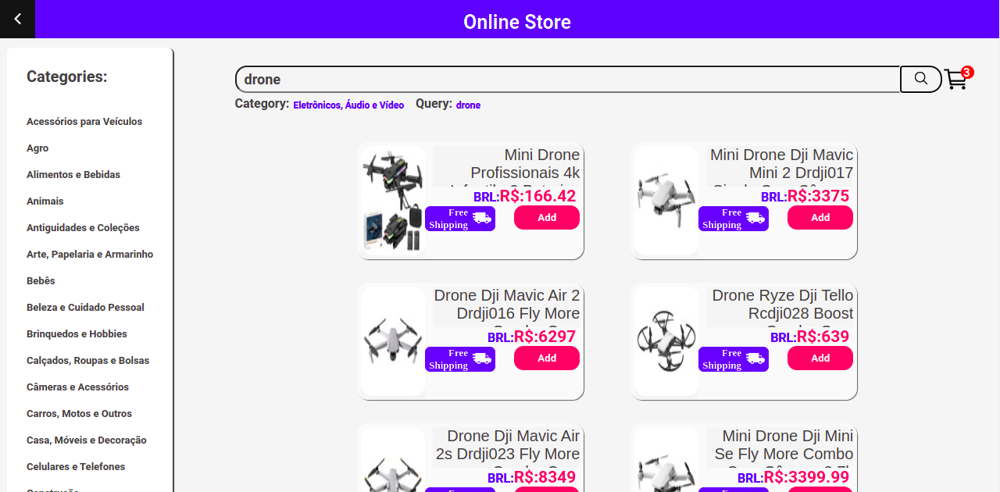

# Frontend Online Store Project

  
<h2>:brazil: Português</h2>

  Esse projeto foi o primeiro projeto do curso de Full Stack Web Developer no módulo de frontend na Trybe realizado em grupo e utilizando Metogologias Ágeis.  Esse projeto teve fins educacionais e foi desenvolvido por mim em conjunto com os amigos: <a href="https://github.com/RENATOADORNO">Renato Adorno</a>, <a href="https://github.com/EOrtulan">Eduardo Ortulan</a>, <a href="https://github.com/Anderson-Zobel">Anderson Zobel</a> e <a href="https://github.com/jotapedrok">Jota Aguiar</a>. 
 Além da Metodologia Scrum com uso de quadro Kanban (usando Trello), usamos funções assíncronas para obter os dados da API do Mercado Livre, utilizamos Props e State.  
  Nesse projeto é possível se acessar o frontend de uma loja online, fazer buscas por categorias, palavras-chave ou ambos; acesssar detalhes dos produtos, adicionar produtos ao carrinho e acessar a loja de finalização de compra.
  
  ## Objetivos
  * Usar a metodologia Scrum, com quadro Kanban (com Trello);
  * Utilizar funções assíncronas para fetch em API's;
  * Transmissão de informações por Props e estado;
  * Construir menu sanduíche;
  * Reutilizar Components;
  * Utilizar rotas;
  * Desenvolver o frontend para uma loja online, com página principal, página de detalhes dos produtos, página de carrinho e página de checkout;
  * Design responsivo.

  ## Live Link
  <a href="https://frontonlinestore.netlify.app/" target="_blank">Frontend Online Store</a>
  
  ## Screenshot
  
   
  
  ## Tecnologias/Ferramentas usadas
  * React;
  * React Router;
  * React Components;
  * HTML;
  * CSS;
  * Javacript;
  * Estado.
  
  ## Como usar
  Acesse o site, faça sua busca por categoria e pelavra-chave, abra os detalhes clicando sobre os produtos, adicione o produto ao carrinho, acesse o carrinho, ajuste as quantidades, clique em Finalizar para acessa a página de Checkout e preencha os dados de entrega.
      
  ## Rodar Localmente
  ### Requisitos:
   * Node v16
   * Google Chrome
    
  ### Clonar no seu computador (via SSH)
  No terminal:
  
    git clone git@github.com:IgorMarinhoArgollo/frontend-online-store.git
  

  ### Iniciando o projeto localmente
  No diretório em que o repositório foi clonado, cole o seguinte comando no terminal para iniciar a aplicação localmente:
   
      npm start
   
  ## Informações de Desenvolvimento (Projeto Original)
  Commits de Desenvolvimento: 45;  
  Tempo Gasto: 4 dias;

##  

This project was the first project of the Full Stack Web Developer course in the frontend module at Trybe carried out in a group and using Agile Methodologies.  This project had educational purposes and was developed by me together with friends: <a href="https://github.com/RENATOADORNO">Renato Adorno</a>, <a href="https://github.com/EOrtulan">Eduardo Ortulan</a>, <a href="https://github.com/Anderson-Zobel">Anderson Zobel</a> and <a href="https://github.com/jotapedrok">Jota Aguiar</a>. 
 In addition to Scrum Methodology using Kanban board (using Trello), we use asynchronous functions to get data from Mercado Livre API, we use Props and State.  
  In this project it is possible to access the frontend of an online store, search by categories, keywords or both; access product details, add products to cart, and access the checkout store.

## My Goals
  * Use Scrum Methodology with a Kanban board (using Trello);
  * Use asynchronous functions to get data from Mercados Livre's API;
  * Transfer information through Props and State;
  * Build a sandwich menu with CSS and State;
  * Reuse Components;
  * Use React Router to create routes;
  * Develop the frontend of an online store with: homepage, product details page, cart page and checkout page;
  * Responsive Design.

## Live Link
  <a href="https://frontonlinestore.netlify.app/" target="_blank">Frontend Online Store</a>
  
## Screenshot

## Used Technologies/Tools
  * React;
  * React Router;
  * React Components;
  * HTML;
  * CSS;
  * Javacript;
  * State.

## How to use it
  Go to the website, search by category and keyword, open the details by clicking on top of the products, add the product to the cart, access the cart, adjust the quantities, click Finish to access the Checkout page and fill in the delivery.
        
## Run Locally
  ### Requirements:
   * Node v16
   * Google Chrome
    
  ### Cloning into your computer (via SSH)
  On terminal:

    git clone git@github.com:IgorMarinhoArgollo/frontend-online-store.git

  ### Starting project locally
  On the directory that you have cloned the repository, paste the command on terminal to start the application:

      npm start

    
## Development Information (Original Project)
  Development Commits: 45;  
  Time Spent: 4 days;   
